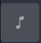

# Resources

## App Icon
The iOS App Icon was generated using Gemini (nanobanana), using the following two prompts:
1. Generate a 1024x1024 App Icon with a plasticky 3D style. It should have be a music note with Google's 4 primary colors
2. Now turn this into a 1024x1024 png, with a pale blue background

## Colors
-- Obtained from reading provided Figma document
-- I also used the following additional colors:
   - "#3EB489", which is a teal-ish green. I asked Gemini to provide me with a green color that matched the existing palette.
   - "#E57373" -- a standard Material Red from Google's Material Design palette.

## Font 
-- Obtained from https://github.com/hprobotic/Google-Sans-Font

## Icons
-- Obtained from https://fonts.google.com/icons?selected=Material+Symbols+Outlined
-- I used light 300, rounded.

Specifically, I downloaded the following:
-- "repeat" -- Fill variation
-- "repeat_one" -- Fill variation
-- "skip_previous" -- Fill variatiosn
-- "skip_next" -- Fill variation
-- "pause" -- Fill variation
-- "favorite" -- Fill variation
-- "favorite" -- Regular variation

## Animations
I took https://lottiefiles.com/free-animation/like-oWZfadnX6c, and took just the burst effect. 

# General Discussion

## Icon Buttons

### Interactions
In general, the Figma uses Material Icons font. I downloaded the icons for us.

To make interactions on the icon buttons feel polished, I do the following:
1. Play haptics on touch-up. 
2. Slightly scale down the icon on touch-down, and scale back up on touch-up.
3. On touch down, I show the selection circle background. This is faded out on touch-up, and I use an animation here.

### Icon specific details
1. Favorite button:
    - The Figma provided the "unfavorited" state as a heart with a stroke.
    - I add the favorited state, which is the filled heart. I chose a particular reddish color to really add some enticing color.
    - I also add a Lottie animation, is a burst of particles that fly outwards, when I transition to the favorited state.
2. Play/Pause button:
    - The Figma provided the "Pause state", which uses the Pause icon
    - I also add the "Play state", which uses the Play icon.
    - In order to make things "look nice", I offset the play icon to the right slightly, and make it a size larger. This 
3. Repeat buttons
    - The Figma provided what seems to be a "repeat-off" state.
    - I felt it appropriate to add a "repeat-on" state, and a "repeat-one" state. The repeat-one state would display the "repeat_one" icon.
    - Repeat being on is indicated via a teal-green color.
4. Skip buttons
    - These match exactly the Figma.

## Timeline Slider
In order to make the timeline slider feel polished and match the Figma, I created my own custom slider.

The overall colors of the bar, and style, was taken from the Figma.

### Time Display
The slider displays current time and duration below the progress bar using compact `M:SS` format (e.g., "2:05", "15:30") with optional leading zero for single-digit minutes. Tracks over an hour use `HH:MM:SS` format. Styled with Medium Google Sans 12pt at 70% opacity, with current time on the left and duration on the right.

### Interactions
The slider provides rich tactile and visual feedback to make dragging feel precise and responsive:

**Visual Feedback**:
- Dragging the knob scales it **UP** (125%) rather than down, which is opposite to button interactions
  - **Rationale**: Scaling up makes the knob more visible and easier to track while dragging, improving precision
  - This also creates a clear visual distinction between "manipulating" (slider) vs "pressing" (buttons)
  - The enlarged knob helps users maintain their drag without losing the visual target

**Haptic Feedback**:
- Fires haptics on both touch-down and touch-up
  - **Touch-down haptic**: Provides immediate confirmation that the user has successfully grabbed the knob
  - **Touch-up haptic**: Confirms the completion of the drag gesture and the new position has been set
  - This dual-haptic approach creates clear boundaries for the interaction, making it feel more intentional and precise

**Three-layer progress bar**:
- Background layer shows the full track length
- Buffered layer indicates how much content is loaded/ready to play
- Progress layer shows actual playback position
- This visual hierarchy provides users with important feedback about both playback progress and buffer status

## Track Display
The track display shows the album artwork alongside the song title and artist name.

### Album Artwork Placeholder
When album artwork is unavailable or still loading, a placeholder image is displayed:

**Design rationale**:
- Uses a subtle gray background that matches the app's overall dark theme
- Features a centered music note icon to clearly indicate missing/loading artwork
- The placeholder ensures the layout remains stable and prevents jarring empty spaces

### Text Handling
The title and artist text are handled differently to balance functionality with visual aesthetics:

1. **Song Title - Marquee Scrolling**:
   - The song title uses a custom marquee implementation that automatically scrolls when the text is too long to fit within the available space
   - The marquee only activates when necessary (text width > container width), otherwise the text remains static
   - This ensures users can always read the full song title, which is the primary identifier for the track

2. **Artist Name - Ellipsis Truncation**:
   - The artist name is truncated with an ellipsis when too long
   - **Design rationale**: While scrolling works well for single-line primary information (the title), implementing marquee for both lines would create visual chaos with multiple simultaneously scrolling elements
   - The artist name is secondary information - users primarily identify songs by their title
   - Truncation provides a cleaner, more stable visual experience that doesn't distract from the main controls

